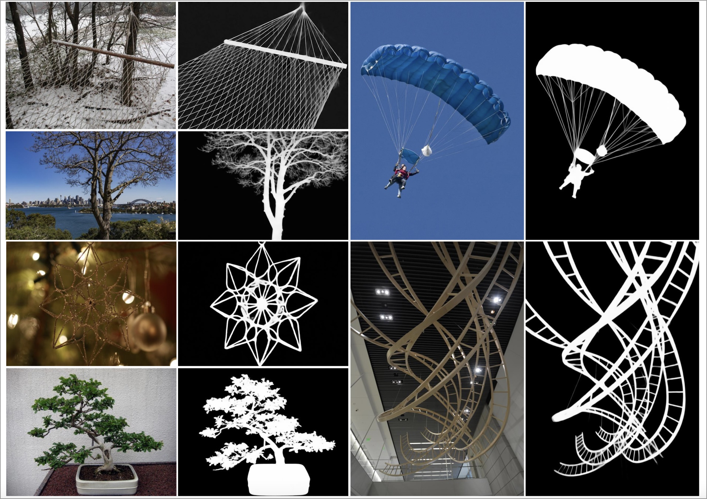

# DiffDIS
The official repo of the ICLR 2025 paper, [High-Precision Dichotomous Image Segmentation via Probing Diffusion Capacity](https://arxiv.org/abs/2410.10105)


## Introduction

<p align="center">
    
</p>

We propose DiffDIS, a diffusion-based segmentation model that taps into the potential of the pre-trained U-Net within diffusion models to maintain a global receptive field while precisely learning target distributions for high-resolution, fine-grained segmentation. It addresses key challenges in conventional diffusion architectures, such as stochastic generation patterns and inefficient inference, and also tackles task-specific complexities in DIS.
- DiffDIS elegantly navigating the traditional struggle to effectively balance the trade-off between receptive field expansion and detail preservation in traditional discriminative learning-based methods.
- We transform the recurrent nature of diffusion models into an end-to-end framework by implementing straightforward one-step denoising, significantly accelerating the inference speed.
- We introduce an auxiliary edge generation task, complemented by an effective interactive module, to achieve a nuanced balance in detail representation while also enhancing the determinism of the generated masks.
- DiffDIS outperform almost all metrics on the DIS benchmark dataset, and thus establishes a new SoTA.


## I. Requiremets

1. Clone this repository
```
git clone git@github.com:qianyu-dlut/DiffDIS.git
cd DiffDIS
```

2.  Install packages

```
source activate base
conda create -n diffdis python==3.10
conda activate diffdis

pip install torch==2.2.0 torchvision==0.17.0 torchaudio==2.2.0 --index-url https://download.pytorch.org/whl/cu118
pip install -r requirements.txt
pip install -e diffusers-0.30.2/
```

## II. Training
1. Download the pretrained model at [sd-turbo](https://huggingface.co/stabilityai/sd-turbo), and update the `--pretrained_model_path` in `./scripts/run_train.sh` with its path.
2. Update the `--dataset_path` in `./scripts/run_train.sh` with the path of training dataset [DIS5K](https://drive.google.com/file/d/1O1eIuXX1hlGsV7qx4eSkjH231q7G1by1/view?usp=sharing).
3. Update the data path (line 7-8) in `get_contour.py` and generate edges by running:
```
python get_contour.py
```
4. Then, you can start training by simply running:
```
cd scripts
bash run_train.sh
```
or you can use [accelerate](https://github.com/huggingface/accelerate) library with updating the `--config_file` in `./scripts/run_train_accelerator.sh` and running:
```
cd scripts
bash run_train_accelerator.sh
```
The model will be saved in `./saved_model/DiffDIS/`

## III. Inference
1. Update the test dataset path in config file `./utils/config.py` (line 3~7)
2. Copy the file `/path/to/sd-turbo/unet/config.json` and paste it under your checkpoint `./saved_model/DiffDIS/Model_XXX/unet/`.
You can also download our trained unet at [Google Drive](https://drive.google.com/drive/folders/1NKmUbn9BiV7xYy_1c2khIBAuOQNuYAdR?usp=sharing).
3. Update the `--checkpoint_path`, `--pretrained_model_path` and `--output_dir` in `./scripts/run_inference.sh`. 

4. Start inference by:
```
cd scripts
bash run_inference.sh
```

## IV. Test
1. Change the predicted map path in `./test_score.py` (line 17) and start testing:
```
python test_score.py
```


## Related work
Our code is based on 

- Marigold: Repurposing Diffusion-Based Image Generators for Monocular Depth Estimation, [Github](https://github.com/prs-eth/marigold)

- GeoWizard: Unleashing the Diffusion Priors for 3D Geometry Estimation from a Single Image, [Github](https://github.com/fuxiao0719/GeoWizard). 

- Diffusers, [Github](https://github.com/huggingface/diffusers) .

We are grateful to the authors of these projects for their pioneering work and contributions!

## To do
- Huggingface app demo on the way...

## Contact
If you have any questions, please feel free to contact me(ms.yuqian AT mail DOT dlut DOT edu DOT cn).

## Citations
If you find this code useful, we kindly ask you to cite our paper in your work.
```
@article{DiffDIS,
  title={High-Precision Dichotomous Image Segmentation via Probing Diffusion Capacity},
  author={Yu, Qian and Jiang, Peng-Tao and Zhang, Hao and Chen, Jinwei and Li, Bo and Zhang, Lihe and Lu, Huchuan},
  journal={arXiv preprint arXiv:2410.10105},
  year={2024}
}

```
